# Pulse

> **Secure Institutional Knowledge Sharing Through Short-Form Video Content**

<div align="center">
  
  
  <br />
  
  [](https://reactnative.dev)
  [](https://expo.dev)
  [](https://www.typescriptlang.org/)
  [](https://developer.apple.com/av-foundation/)
  [](https://developer.android.com/guide/topics/media/media3)
  [](https://github.com/mieweb/pulse)
</div>

**Pulse** is a React Native application designed specifically for **institutional knowledge sharing** and **training documentation**. Built for organizations that need to capture, organize, and share institutional knowledge through short-form video content with enterprise-grade security and professional editing capabilities.

## 🎯 Purpose & Vision

Pulse addresses the critical need for modern institutional knowledge management by providing:

- **Secure Video Documentation**: Capture institutional procedures, training materials, and knowledge transfer sessions
- **Professional Content Creation**: Advanced editing tools for creating polished institutional content
- **Cross-Platform Accessibility**: Works seamlessly across iOS and Android devices
- **Local-First Security**: All content remains on-device until explicitly shared through secure channels

### Institutional Use Cases

- **Training Documentation**: Create step-by-step training videos for new employees
- **Process Documentation**: Record institutional procedures and workflows
- **Knowledge Transfer**: Capture expert knowledge before staff transitions
- **Compliance Training**: Develop engaging compliance and safety training materials
- **Institutional Memory**: Preserve institutional knowledge and best practices

## 🚀 Key Features

### Professional Recording & Editing

- **Segmented Recording** - Record multiple clips that combine seamlessly for comprehensive training content
- **Time Selection** - Choose from 15s, 30s, 1m, or 3m recording durations perfect for different training scenarios
- **Native Video Processing** - Hardware-accelerated video concatenation with AVFoundation for professional quality
- **Drag & Drop Reordering** - Intuitive visual reordering with real-time drop indicators for content organization
- **Undo/Redo System** - Full editing control with persistent storage across app sessions

### Institutional Security & Workflow

- **Local-First Storage** - All content remains secure on your device until explicitly shared
- **Deep Linking** - Custom `pulsecam://` URL scheme for direct app access and institutional integration
- **Draft Management** - Auto-save your work and continue later with intelligent draft system
- **Draft Transfer** - Export and import drafts between devices via AirDrop, Files app, or device transfer
- **Cross-Platform** - React Native with Expo for iOS and Android ensuring organization-wide compatibility
- **Real-Time Progress** - Live progress tracking and auto-save functionality for uninterrupted workflow

### Professional Controls

- **Camera Controls** - Flash, camera flip, zoom, and stabilization for professional-quality recordings
- **Video Library Integration** - Import existing videos from your gallery and mix with new recordings
- **Smart Duration Management** - Set recording limits and prevent content from exceeding institutional guidelines
- **Hardware Acceleration** - Native video processing for optimal performance on all devices

## 📱 Draft Transfer & Backup

Pulse supports multiple methods for transferring drafts between devices:

- **Automatic Transfer**: Drafts transfer automatically when migrating to a new iPhone using Apple's device transfer
- **Manual Export/Import**: Export individual drafts or all drafts as backup files
- **AirDrop Sharing**: Quickly share drafts with nearby devices or collaborators
- **Files App Integration**: Save drafts to iCloud Drive or local storage for backup

For detailed instructions, see [DRAFT_TRANSFER.md](./DRAFT_TRANSFER.md).

## 📚 Research Context

Pulse is developed as part of ongoing research into **institutional knowledge management** and **video-based documentation systems**. The project explores:

- **Business Value Assessment**: How video documentation impacts ticket resolution time, knowledge adoption, and collaboration efficiency
- **Technical Scalability**: Challenges in scaling secure video capture, editing, and delivery for organizational use
- **User Adoption Studies**: Factors influencing adoption of video-first knowledge-sharing platforms in institutional settings

### Research Objectives

1. **Evaluate Business Value**: Compare organizational outcomes between traditional documentation and video-first approaches
2. **Design & Develop Platform**: Implement secure cross-platform mobile app with scalable backend pipeline
3. **Assess Adoption & Usability**: Conduct user studies to analyze usability, knowledge retention, and satisfaction

## 🏢 Institutional Deployment

### For Organizations

Pulse is designed for institutional deployment with the following considerations:

- **Security-First Design**: All content remains on-device until explicitly shared through secure channels
- **Compliance Ready**: Built with institutional data policies and compliance requirements in mind
- **Scalable Architecture**: Designed to integrate with existing institutional infrastructure
- **Cross-Platform Support**: Ensures all team members can participate regardless of device

### Future Backend Integration

Planned features for institutional deployment:

- **Cloudflare Stream Integration**: Secure video hosting and adaptive streaming
- **Institutional Authentication**: Integration with existing organizational identity systems
- **Content Management**: Centralized content library with access controls
- **Analytics Dashboard**: Usage analytics and content effectiveness metrics

## 🔐 Authentication Flow

The following diagram illustrates the complete OAuth 2.0 + PKCE authentication flow between the Pulse mobile app and the PulseVault backend:

```mermaid
sequenceDiagram
    actor User
    participant PulseApp as Pulse App<br/>(React Native)
    participant SecureStore as Secure Storage
    participant Browser as System Browser
    participant PulseVault as PulseVault Backend<br/>(Express Server)
    participant Database as Database

    Note over User,Database: 1. APP INITIALIZATION
    User->>PulseApp: Opens Pulse App
    PulseApp->>SecureStore: Check for access_token
    SecureStore-->>PulseApp: No token found
    PulseApp->>User: Show Login Screen

    Note over User,Database: 2. USER INITIATES LOGIN
    User->>PulseApp: Enters Vault URL<br/>clicks "Login"
    PulseApp->>SecureStore: Store vault URL
    
    Note over User,Database: 3. PKCE GENERATION (Client-Side Security)
    PulseApp->>PulseApp: Generate random<br/>code_verifier (32 bytes)
    PulseApp->>PulseApp: Hash code_verifier<br/>→ code_challenge (SHA256)
    PulseApp->>PulseApp: Generate random state
    PulseApp->>SecureStore: Store state & code_verifier

    Note over User,Database: 4. OPEN AUTHORIZATION URL
    PulseApp->>Browser: Open Authorization URL:<br/>GET /oauth/authorize?<br/>response_type=code&<br/>client_id=pulse-mobile&<br/>redirect_uri=pulse://auth/callback&<br/>code_challenge=xyz&<br/>code_challenge_method=S256&<br/>state=abc
    Browser->>PulseVault: GET /oauth/authorize
    
    Note over User,Database: 5. VALIDATE & SHOW LOGIN PAGE
    PulseVault->>PulseVault: Validate parameters<br/>(PKCE required, valid redirect_uri)
    PulseVault-->>Browser: Render login.ejs<br/>(with hidden OAuth params)
    Browser-->>User: Display login form

    Note over User,Database: 6. USER AUTHENTICATES
    User->>Browser: Enter email & password<br/>click "Login"
    Browser->>PulseVault: POST /auth/login<br/>{email, password,<br/>code_challenge,<br/>redirect_uri, state}
    
    Note over User,Database: 7. VERIFY CREDENTIALS
    PulseVault->>Database: SELECT user WHERE email=?
    Database-->>PulseVault: User record
    PulseVault->>PulseVault: Verify password<br/>(bcrypt compare)
    
    Note over User,Database: 8. GENERATE AUTHORIZATION CODE
    PulseVault->>PulseVault: Generate auth code<br/>(32 random bytes)
    PulseVault->>Database: INSERT INTO oauth_authorization_codes<br/>(code, user_id, code_challenge,<br/>expires_at: now + 10 min)
    Database-->>PulseVault: Success
    
    Note over User,Database: 9. REDIRECT TO APP WITH CODE
    PulseVault-->>Browser: HTTP 302 Redirect<br/>pulse://auth/callback?<br/>code=xyz&state=abc
    Browser->>PulseApp: Deep link callback

    Note over User,Database: 10. VERIFY STATE & EXCHANGE CODE
    PulseApp->>SecureStore: Get stored state
    SecureStore-->>PulseApp: state value
    PulseApp->>PulseApp: Verify state matches<br/>(CSRF protection)
    PulseApp->>SecureStore: Get code_verifier
    SecureStore-->>PulseApp: code_verifier
    
    Note over User,Database: 11. TOKEN EXCHANGE REQUEST
    PulseApp->>PulseVault: POST /oauth/token<br/>{grant_type: "authorization_code",<br/>code: xyz,<br/>code_verifier: original_verifier,<br/>redirect_uri,<br/>device_id}

    Note over User,Database: 12. VERIFY PKCE CHALLENGE
    PulseVault->>Database: SELECT FROM oauth_authorization_codes<br/>WHERE code=? AND used=false<br/>AND expires_at > now
    Database-->>PulseVault: code_challenge, user_id
    PulseVault->>PulseVault: Hash received code_verifier<br/>→ computed_challenge
    PulseVault->>PulseVault: Compare:<br/>computed_challenge == stored_challenge
    
    Note over User,Database: 13. MARK CODE AS USED
    PulseVault->>Database: UPDATE oauth_authorization_codes<br/>SET used=true WHERE code=?
    Database-->>PulseVault: Success

    Note over User,Database: 14. GENERATE JWT TOKENS
    PulseVault->>PulseVault: Generate access_token<br/>(JWT, 30 min expiry)
    PulseVault->>PulseVault: Generate refresh_token<br/>(JWT, 30 day expiry)
    PulseVault->>Database: INSERT INTO oauth_access_tokens<br/>(user_id, access_token,<br/>refresh_token, device_id,<br/>expires_at)
    Database-->>PulseVault: Success

    Note over User,Database: 15. RETURN TOKENS TO APP
    PulseVault-->>PulseApp: {access_token,<br/>refresh_token,<br/>token_type: "Bearer",<br/>expires_in: 1800}

    Note over User,Database: 16. STORE TOKENS SECURELY
    PulseApp->>SecureStore: Store access_token
    PulseApp->>SecureStore: Store refresh_token
    PulseApp->>SecureStore: Store token_expiry
    SecureStore-->>PulseApp: Success
    PulseApp->>User: Navigate to Home Screen

    Note over User,Database: 17. MAKE AUTHENTICATED API REQUESTS
    User->>PulseApp: View profile
    PulseApp->>SecureStore: Get access_token
    SecureStore-->>PulseApp: access_token
    PulseApp->>PulseApp: Check if token expired
    PulseApp->>PulseVault: GET /api/user/profile<br/>Authorization: Bearer {token}

    Note over User,Database: 18. VERIFY TOKEN
    PulseVault->>PulseVault: Verify JWT signature<br/>& expiration
    PulseVault->>Database: SELECT FROM oauth_access_tokens<br/>WHERE access_token=?<br/>AND revoked=false
    Database-->>PulseVault: Token valid, user_id
    PulseVault->>Database: SELECT user profile<br/>WHERE id=user_id
    Database-->>PulseVault: User data
    PulseVault-->>PulseApp: {id, email, name}
    PulseApp-->>User: Display profile

    Note over User,Database: 19. TOKEN EXPIRATION & REFRESH
    User->>PulseApp: Make API request<br/>(after 30+ minutes)
    PulseApp->>SecureStore: Get access_token
    SecureStore-->>PulseApp: access_token (expired)
    PulseApp->>PulseApp: Check expiry:<br/>token is expired
    PulseApp->>SecureStore: Get refresh_token
    SecureStore-->>PulseApp: refresh_token
    
    Note over User,Database: 20. REFRESH TOKEN REQUEST
    PulseApp->>PulseVault: POST /oauth/token/refresh<br/>{grant_type: "refresh_token",<br/>refresh_token}
    PulseVault->>PulseVault: Verify refresh_token JWT
    PulseVault->>Database: SELECT FROM oauth_access_tokens<br/>WHERE refresh_token=?<br/>AND revoked=false
    Database-->>PulseVault: Valid, user_id
    PulseVault->>PulseVault: Generate new access_token
    PulseVault->>Database: UPDATE oauth_access_tokens<br/>SET access_token=new_token
    Database-->>PulseVault: Success
    PulseVault-->>PulseApp: {access_token, expires_in: 1800}
    PulseApp->>SecureStore: Store new access_token
    PulseApp->>PulseApp: Retry original API request

    Note over User,Database: 21. LOGOUT FLOW
    User->>PulseApp: Click "Logout"
    PulseApp->>SecureStore: Delete access_token
    PulseApp->>SecureStore: Delete refresh_token
    PulseApp->>SecureStore: Delete token_expiry
    PulseApp->>SecureStore: Delete vault URL
    SecureStore-->>PulseApp: Cleared
    PulseApp-->>User: Navigate to Login Screen
```



## Installation

```bash
git clone https://github.com/mieweb/pulse.git
cd pulse
npm install
```

## Setup

### Prerequisites

- Node.js 18+
- Expo CLI
- Xcode (for iOS development)
- Android Studio (for Android development)

### Development Setup

```bash
# Install dependencies
npm install

# Start Expo development server
npx expo start

# For iOS development
npx expo prebuild
cd ios
pod install
open pulse.xcworkspace
# Build and run in Xcode

# For Android development
npx expo run:android
```

**Required Permissions:**

- Camera Access
- Microphone Access
- Storage Access

## Configuration

### Recording Settings

```typescript
const defaultSettings = {
  maxIndividualDuration: 60, // Maximum duration for a single recording segment
  holdDelay: 500, // Delay before hold recording starts (ms)
  progressUpdateInterval: 100, // Progress update frequency (ms)
};
```

### Video Stabilization

The app includes cross-platform video stabilization controls:

- **iOS**: Full range of stabilization modes (`off`, `standard`, `cinematic`, `cinematicExtended`, `auto`)
- **Android**: Simple on/off control
- **Control**: Tap to cycle modes, long-press for mode picker
- **Platform Mapping**: iOS-specific modes automatically map to "on" on Android

For detailed information, see [VIDEO_STABILIZATION.md](./VIDEO_STABILIZATION.md).

### Time Options

```typescript
const timeOptions = [
  { label: "15s", value: 15 },
  { label: "30s", value: 30 },
  { label: "1m", value: 60 },
  { label: "3m", value: 180 },
];
```

### Video Concatenation

```typescript
interface RecordingSegment {
  id: string;
  duration: number;
  uri: string;
  inMs?: number; // Optional start trim point
  outMs?: number; // Optional end trim point
}

// Usage
const outputUri = await VideoConcatModule.export(segments);
```

## Development

### CodeQL Configuration

This project includes automated CodeQL security analysis for Swift/iOS code. The CodeQL workflow is configured to build the React Native iOS project with the following settings:

- **Workspace**: `ios/pulse.xcworkspace`
- **Scheme**: `pulsecam`
- **SDK**: iPhone Simulator SDK
- **Configuration**: Debug build with code signing disabled

#### Updating Xcode Configuration

If you need to update the workspace name or scheme used by CodeQL:

1. **Workspace Changes**: If you rename the Xcode workspace file, update the `-workspace` parameter in `.github/workflows/codeql.yml`:

   ```bash
   -workspace YourNewWorkspace.xcworkspace \
   ```

2. **Scheme Changes**: If you rename the app scheme, update the `-scheme` parameter in `.github/workflows/codeql.yml`:

   ```bash
   -scheme YourNewScheme \
   ```

3. **Target Changes**: If you add new Swift files or targets, ensure they are included in the main app scheme for CodeQL analysis.

The CodeQL analysis requires:

- CocoaPods dependencies installed (`pod install`)
- Code signing disabled (`CODE_SIGNING_ALLOWED=NO`)
- Metro bundler skipped (`RCT_NO_LAUNCH_PACKAGER=1`, `SKIP_BUNDLING=1`)
- iPhone simulator build target

### Project Structure

```
pulse/
├── app/                    # App router screens
├── components/            # Reusable UI components
├── modules/               # Native modules
│   └── video-concat/      # Video concatenation module
├── hooks/                 # Custom React hooks
├── constants/             # App configuration
└── package.json           # Dependencies
```

### Building

```bash
# Run linting
npm run lint

# Type checking
npx tsc --noEmit

# Build for production
eas build --platform ios --profile production
eas build --platform android --profile production
```

## Contributing

1. Fork the repository
2. Create a feature branch: `git checkout -b feature/amazing-feature`
3. Make your changes and test on both iOS and Android
4. Commit your changes: `git commit -m 'feat: add amazing feature'`
5. Push to your branch: `git push origin feature/amazing-feature`
6. Open a Pull Request

## Acknowledgments

### Development Team

- **Primary Developer**: [Priyam More](https://github.com/morepriyam) - Research and development of institutional knowledge sharing platform
- **Institutional Partner**: [**Medical Informatics Engineering, Inc.**](https://github.com/mieweb) - Providing research context and institutional requirements
- **Research Advisor**: [**Doug Horner**](https://github.com/horner) - Guidance on institutional knowledge management and video-based documentation systems

### Technology Stack

- Built with [React Native](https://reactnative.dev/) and [Expo](https://expo.dev/) for cross-platform institutional deployment
- Video processing powered by native AVFoundation (iOS) and Media3 (Android) for professional quality
- Icons by [Expo Symbols](https://expo.dev/guides/using-symbols/) for consistent institutional branding

### Research & Development

This project is part of ongoing research into institutional knowledge management and video-based documentation systems. Special thanks to the institutional partners and research participants who have contributed to the development and validation of this platform.

### Future Collaborations

We welcome partnerships with institutions interested in implementing video-based knowledge sharing systems. Contact us to discuss collaboration opportunities and institutional deployment strategies.

## License

[MIT](LICENSE)

---

<div align="center">
Made with ❤️ for institutional knowledge sharing and professional training
</div>
